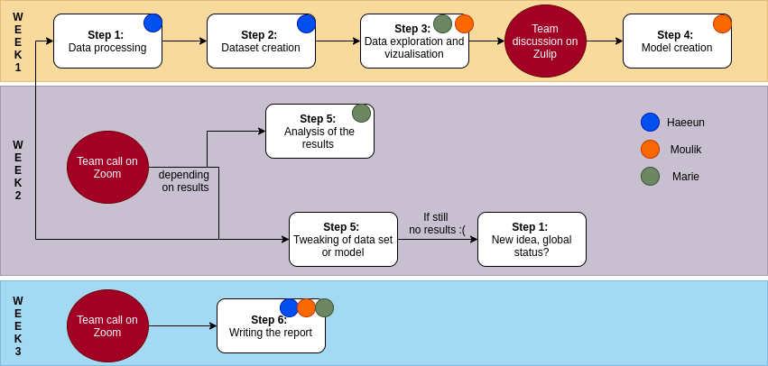

# What is actually status?

## Abstract
The paper “Signed Networks in Social Media” motivates towards the formulation of the theory of status in predicting network structures. Implicit notions of status already exist in modern social media like the number of Instagram followers or karma in Reddit. However, this work does not attempt to relate status to this more intuitive notion we observe in real life. It limits analysis to more relative comparisons between neighboring nodes in local triads. To that end, we attempt to flesh out this notion of status in a more global sense. We use an extended version of the Epinions dataset which contains additional information beyond the signed network. Features such as the nature as well as the number of reviews (user activeness), and user anonymity, should intuitively play a strong role in determining his status within the social media hierarchy and we explore this relationship in this study.

## Research questions
Assuming that the results found in the paper hold (temporal directed triads are consistent with status theory), can we build a model that will predict the relative status of each node (positive or negative link) using the features at our disposition?
How does this model relate to status? Can we talk about a local status (of a node relative to its neighboring) as in the paper, or can we extract a more global definition of status in these findings?

## Proposed dataset
We will use Epinions dataset from the paper and extend it with two other datasets that can be found [here] (http://trustlet.org/extended_epinions.html)

**articles by user dataset:**

- CONTENT_ID The object ID of the article.
- AUTHOR_ID The ID of the user who wrote the article
- SUBJECT_ID The ID of the subject that the article is supposed to be about

**ratings:**

- OBJECT_ID The object ID is the object that is being rated. The only valid objects at the present time are the content_id of the member_content table. This means that at present this table only stores the ratings on reviews and essays
- MEMBER_ID Stores the id of the member who is rating the object
- RATING Stores the 1-5 (1- Not helpful , 2 - Somewhat Helpful, 3 - Helpful 4 - Very Helpful 5- Most Helpful) -rating of the object by member [There are some 6s, treat them as 5]
- STATUS The display status of the rating. 1 :- means the member has chosen not to show his rating of the object and 0 meaning the member does not mind showing his name beside the rating.
- CREATION The date on which the member first rated this object
- LAST_MODIFIED The latest date on which the member modified his rating of the object
- TYPE If and when we allow more than just content rating to be stored in this table, then this column would store the type of the object being rated.
- VERTICAL_ID Vertical_id of the review.

## Methods
For our analysis, we will use the results of the reference paper ('Signed Network'), where the big majority (14 out of 16) of triads in the evolving directed network are consistent with status theory. In order to reproduce the conditions of analysis of the paper, we will only consider in our analysis links from A to B where both A and B have **previously** formed a link with X.
Once we have selected the edges we are interested about, we will perform some data handling and transform our dataset to have the following structure:

| node_A | ratingscores_A | nbrratings_A | anonymity_A | .. | node_B | ratingscores_B | nbrratings_B | anonymity_B | edge_AB

This is not a definitive list of features, some might be added or removed. Once our dataset is correctly constructed, we will perform some data analysis steps to gain some insight on the distribution of the features according to the sign of the edge (higher or lower relative status). We will perform some global analysis (such as distribution of rating scores of A) as well as some pairwise analysis to identify the relationships between A and B.

The next step will be to construct a model that will be able to predict the sign of the edge between A and B using the different features we have in our dataset. Once this model is constructed, we will be able to determine which features (if any) are related to status. We will have to determine in this step what is the accuracy we want to achieve with the model, as we feel that there is a tolerance for error that comes from the fact that not all the triads are consistent with status theory.
If the model doesn't give anything satisfying, we will try to extract new features out of the dataset or remove the first step of processing of the edges. We also have some backup ideas in case we really don't get any results (see questions to TAs section).

## Proposed timeline
As we have the issue of not knowing in advance if we will have exploitable results with the model, we have decided to complete most of the work on the first week in order to be able to bounce back if anything goes wrong. We plan on interpreting the results, doing additional tests or changing direction (depending on the results of the first week) during the second week. We will write the report and work on our personal replications on the third week. We will then work on the video starting from the 18th of December until the deadline.

## Organization within the team
Below is a graph of the planned organization for the team. This organization is not rigid, and we plan on modifying it if a team member has any problem with a part that was assigned to them.

## Questions for the TA

Is it dramatic if we find out that the features don't actually explain status?
We are following the assumptions and results exposed in the paper, is this a correct approach?
We have additional ideas about understanding if the concept of status can be globally applicable, for instance by calculating status value for each node in the network by modifying the HITS algorithm and viewing the status of its neighbors as an indicator of its own status. For brevity, we don’t mention it in our initial study, but will it be okay if we include it in our final project, if need be, to supplement our original findings?
